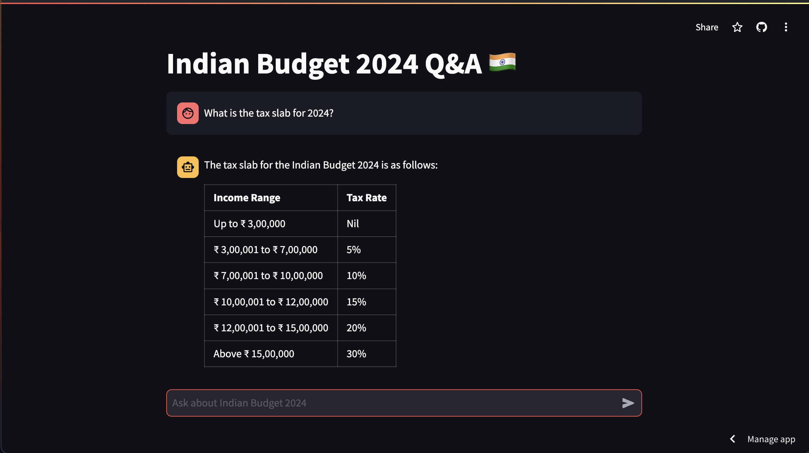

# BudgetGPT

An AI Assistant who can answer questions on Indian budget 2024-25

## Overview

BudgetGPT is an AI Assistant designed to provide insights and answer questions related to the Indian Budget for the year 2024-25. It leverages advanced language models to deliver accurate and relevant information.

## Features

- **Interactive Q&A**: Users can ask questions about the Indian Budget 2024-25 and receive detailed responses.
- **Comparison Capabilities**: The assistant can compare the current budget with previous years, providing a clear understanding of changes and trends.
- **Holistic Summaries**: Users can request comprehensive summaries of the budget, making it easier to grasp the overall financial landscape.

## Getting Started

1. **Environment Setup**: Ensure you have the required environment variables set up, particularly the `OPENAI_API_KEY`.
2. **Data Preparation**: The application reads data from PDF files located in the `pdfs` directory and stores processed information in the `data` directory.
3. **Running the Application**: Use Streamlit to run the application and interact with the AI assistant with `streamlit run app.py`

## Usage

Simply type your question regarding the Indian Budget 2024-25 in the chat interface, and the assistant will provide you with the information you need.

## Contributing

Contributions are welcome! Please feel free to submit issues or pull requests to enhance the functionality of BudgetGPT.

## License

This project is licensed under the MIT License.
